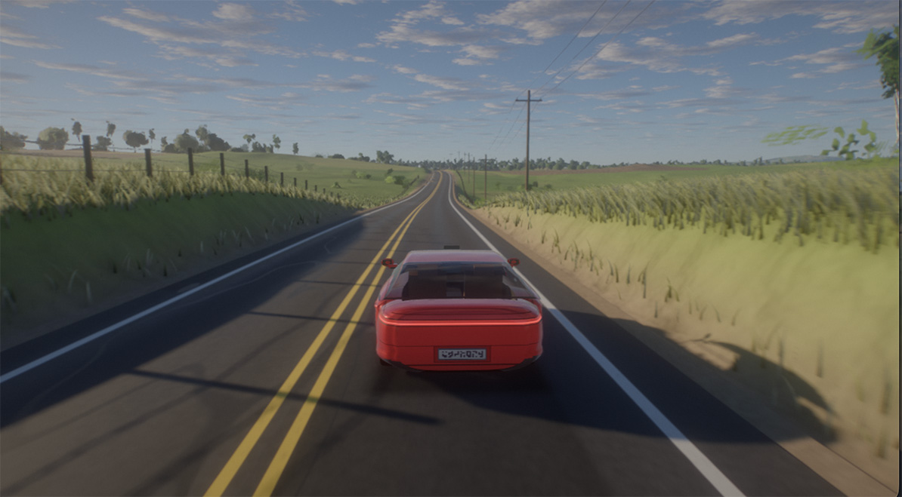
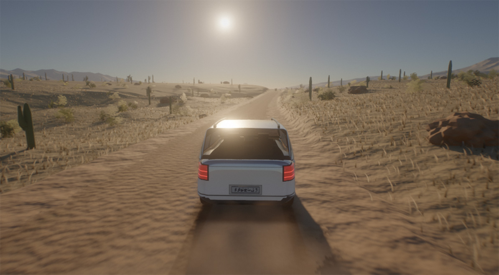
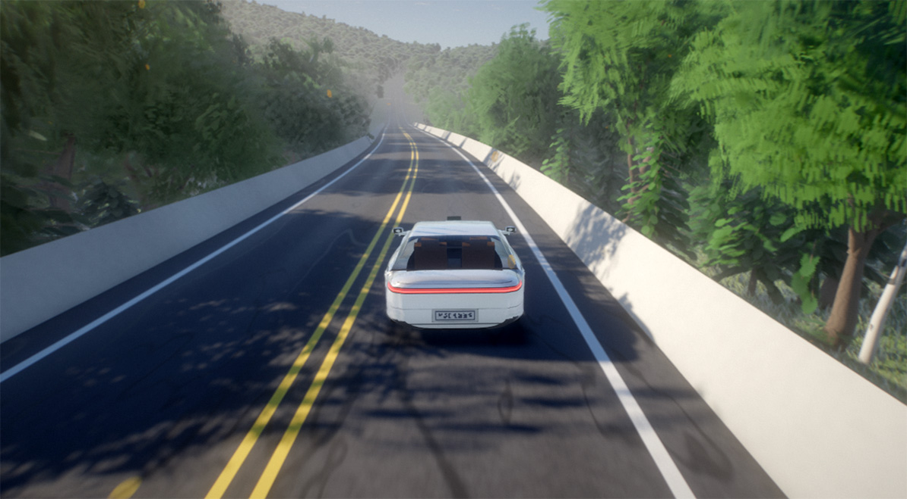
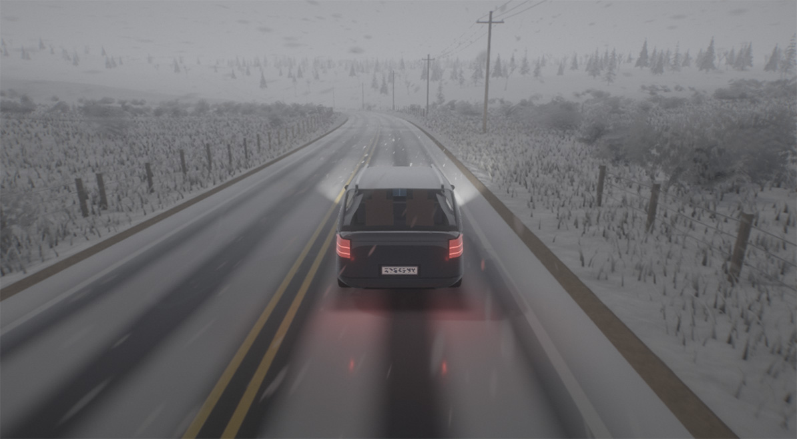
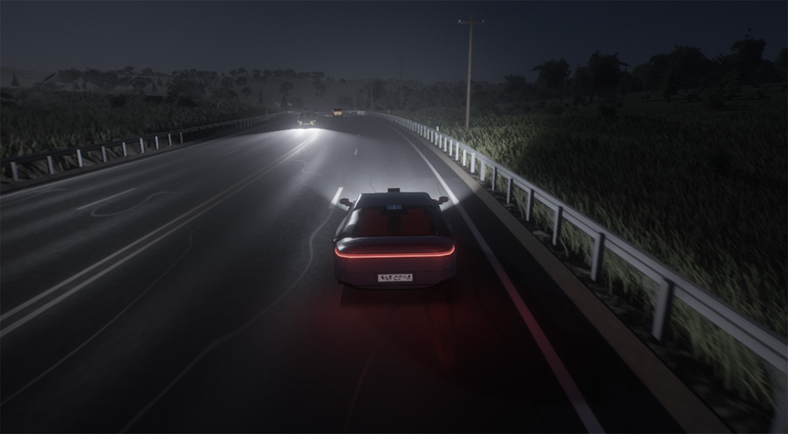
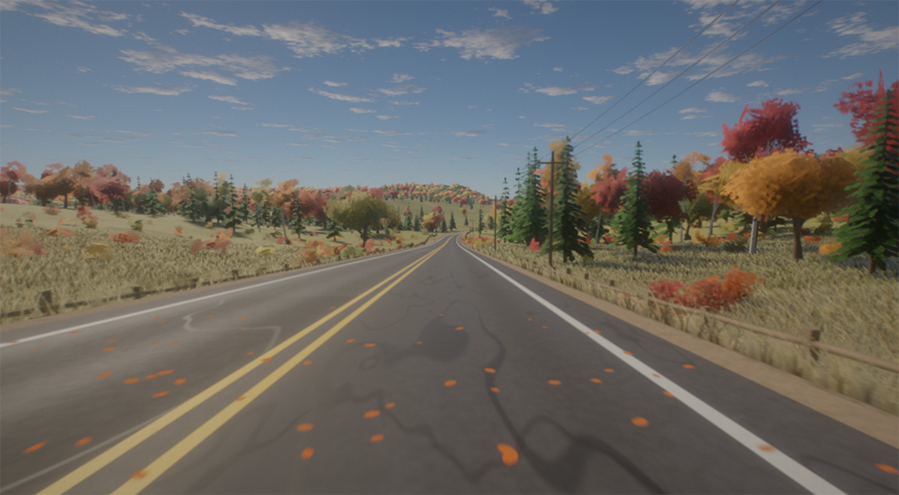
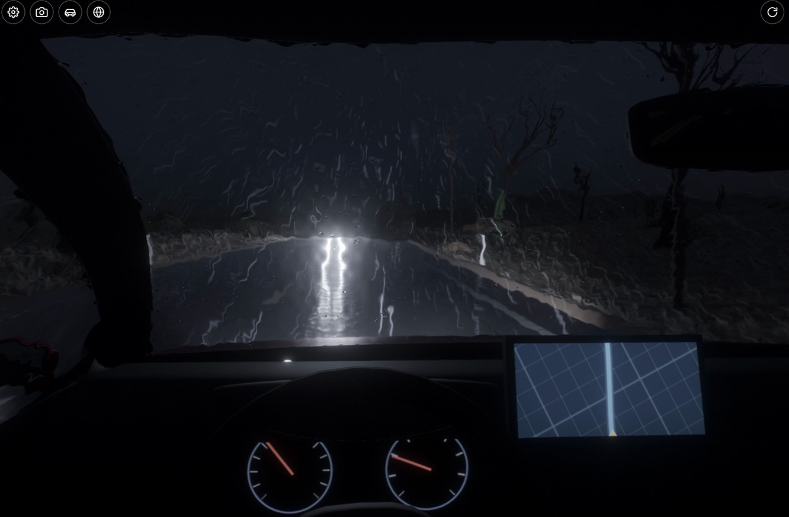

# WebGPU Driving with 10 environments in 163k

[Live](https://greggman.github.io/webgpu-driving)

A relaxing, endless, procedurally generated drive rendered with WebGPU and no libraries.
The world, the cars and the car interior are all procedural. The car drives itself and a
"car commercial" camera director cuts between helicopter, drone, chase, roadside, dolly,
wheel, hood and interior shots.















https://github.com/user-attachments/assets/d8b28ee4-b77f-435c-a15c-491157bf5736

Nine environments: **country road**, **desert dirt road**, **ocean coastline**,
**forest flower road**, **Pennsylvania snowstorm**, **La Honda Road**, **night drive** and
**Arizona storm** (rainy desert night with lightning; rain on the glass refracts the view
from inside and the wipers clear it) and **New England autumn** (red / orange / gold
hillsides; fallen leaves on the road that the car blows away).

## Dev Notes

This was inspired by a video I saw of cars going down a road. I don't know what the first game to do this is but the one
I remember most is [Road Rash for the Sega Gensis](https://youtu.be/akApwANv-KM?t=295). 
Chaining road segments on a long road avoids the problem of trying to draw an entire world. You just draw forward or backward N "strips".
Sure, games like Pole Position, Hang-On, OutRun also did this kind of but they weren't "3D". Neither is Road Rash on Gensis but,
as the series progressed, it did eventually get to "real 3d" and for a 3d engine it benefits from being able to render strips
and not have to come up with some more open world PVS system.

I get that some people might see this as AI slop. That's fine. If it's not your thing then don't look?
I think there's more here than just that. For example: One issue with 3D games on the Web is they
usually need to download 100s of megs of data. This entire demo is 170k gzipped! All cars, all 10 environments,
all skies, all trees, bushes, flowers, textures, etc....  It's effectively showing there's been
a huge opportuntity for fast to download beautiful games that's entirely been ignored for the last
15 years. I think that's valuable, regardless of how this was created.

As for how, I wrote [the prompt](DESIGN.md), and asked for a plan. Then I asked it to follow the plan.
2hrs later it was working with several biomes. I spent another 2 days working through smaller issues
and asking for small tweaks. 

Maybe the most interesting was trying to get better looking cars. I can't say the cars are great now
but they are significantly better than when it started. It tried for a while and wasn't getting much
better. Two things I asked which helped. One, I told it to use 2 more agents. So the main agent would
provide the code, another agent would design the car, a 3rd agent would judge. 2nd, I suggested it
use NURBS to model. Before that it was using polygons. Both of those helped get them to where they
are now. Separate from the looks, there are still issues like the semi truck's cab and trailer are not
connected correctly. Also, cameras don't take into account the semi and bus.

Another big issue is perf. The forest looks pretty good because it has so many trees but it's also 3x
slower to render. The New England autumn leaves biome has the same issue. We had some ideas and one
is in the settings (Detailed Leaf Shadows - on on desktop, off on mobile). It doesn't help much.
You can turn off all of the other post-processing type effects (bloom, TAA, DOF, etc) and it helps
the frame rate but not enough to hit 60fps consistently on my M1 Mac. I don't think I'm going to
spend any time fixing it though. It's still pleasent to look at.

Overall, I'm really impressed. And of course things will only get better. Even though they are
not perfect I'm particularly happy with the snow on the windows from the driver's POV in the snow biome.
And, even more with the rain on the windows in the Arizona rain biome, as well as the lights from the
on coming cars and the lightning.

## Controls

| Key | Action |
|---|---|
| ← / → (A / D) | change lanes (only when it's safe; you can't crash) |
| ↑ / ↓ (W / S) | speed up / slow down |
| C (or the camera button, top left) | cycle camera: auto director, then each shot in turn (kept when switching environments) |
| V (or the car button, top left) | cycle the player's vehicle (6 cars, a semi truck with trailer, a bus) |
| drag / wheel (touch: drag / pinch) | orbit camera around the car, dolly in / out |
| ← → ↑ ↓ (orbit camera) | move the orbit focus around the car (Shift+↑/↓: up / down; within 10 m) |
| R (or the ↻ button, top right) | generate a new world (new seed) |
| P | toggle autopilot |
| ⚙ (top left) | settings: environment, time of day, clouds, speed, camera, graphics toggles |
| 1 – 9, 0 | switch environment |
| B (or the globe button, top left) | next environment |
| H | show / hide the HUD |
| M (with `record=1`) | start / stop recording a video of the canvas (downloads an .mp4 when stopped) |

## URL parameters

Useful for sharing a view and for deterministic screenshots:

- `biome=country|desert|coast|bigsur|forest|snow|lahonda|night|arizona|autumn` (without it, a random environment
  and seed are chosen; the page never writes it into the URL, so shared links stay plain)
- `seed=N`: world seed
- `car=sedan|hatch|suv|coupe|wagon|pickup|semi|bus`: the player's vehicle
- `s=N`: start distance along the road (m)
- `tod=H`: time of day (hours)
- `cam=chase|helicopter|drone|roadside|dolly|wheel|interior|passenger|topdown|hood|front|custom`
- `eye=f,l,u&look=f,l,u&fov=deg`: car-relative custom camera (with `cam=custom`)
- `t=N`: time into the camera shot
- `freeze=1`: stop the simulation clock (the renderer keeps running so TAA converges)
- `hud=0`: hide the HUD
- `size=WxH`: make the canvas exactly W×H CSS pixels (centred, not scaled) and render it at the
  display's device pixel ratio, for screen capture: on a 2x (Retina) display `size=960x540` is a
  1920×1080 image, on a 1x display use `size=1920x1080`
- `record=1`: enable the M key to record the canvas to a video file
- `speed=N`: simulation time scale (e.g. `speed=8` for soak testing)
- `debug=noterrain,nodof,nomb,nobody,novegshadow,nograss,nolod0,probe`: debugging toggles

## Development

```sh
npm install
npm run dev        # esbuild watch -> dist/
npm run serve      # express static server on http://localhost:8080
npm test           # wgsl check, typecheck, gts lint, build, unit tests, screenshots
```

Other tools:

- `npm run shoot [filter] -- --shots test/shots-gallery.json`: render deterministic
  screenshots (headless Chrome through puppeteer, no special flags) into `screenshots/`.
  The run fails on any `[gpu-error]` (every uncaptured WebGPU error is printed with that
  prefix), on page errors, and on blank frames.
- `node test/contact.js [filter]`: contact sheet of the screenshots.
- `node test/perf.js [biome...] [--debug flags]`: live frame rate and GPU pass timings
  (timestamp queries).
- `node test/probe.js "<query>" "<js expression>"`: evaluate an expression in a running
  page.
- `npm run soak`: drives several environments at 8× for about 8 km each (origin rebasing,
  streaming, clipmap recentering, camera cuts) and fails on any GPU or page error.
- `.claude/agents/aaa-judge.md`: an agent whose only job is to judge screenshots against
  AAA and car-commercial quality and rank fixes.

Deployment: `.github/workflows/pages.yml` builds and publishes `dist/` to GitHub Pages on
every push to `main`.

## Architecture

**The road is the world's spine.** Every system uses the road's arc length `s`.

- The road only trends forward (|heading| < max), so world z increases monotonically along
  it. The centerline is stored as `x(z), y(z), heading(z)`, every 2 m (`src/world/road.ts`).
- "Nearest road point" becomes two Newton steps on a 1D texture, on both the CPU and the
  GPU.
- The elevation is a grade-limited, twice box-filtered copy of the terrain along the
  centerline.
- Bridges appear where the ground falls well below the deck.

**Streaming along the road.** Content only exists in a 1D window along the road:
- road chunks: 400 m behind, 4.2 km ahead;
- props: 300 m behind, 1.6 km ahead;
- the GPU road texture: 4 km behind, 12 km ahead.

The world origin is rebased every 1 km, so f32 precision stays sub-millimetre near the
camera.

**Terrain LOD** (`src/render/terrain.ts`):
- **Height clipmaps:** 8 levels of 512², from 0.5 m to 64 m texels. They are computed by
  compute shaders from the same height function the CPU uses (`terrain.ts` ↔
  `terrain.wgsl`), and recentred as the camera moves.
- **Mesh:** a **CDLOD** quadtree of instanced 32×32 patches with vertex morphing.
- Level texel centres line up with patch vertices, so neighbouring LODs agree exactly.
- Far terrain is shadowed by ray-marching the heightfield.

**Atmosphere** (`src/shaders/atmo_*.wgsl`) follows Hillaire 2020:
- transmittance, multiple-scattering, sky-view and aerial-perspective LUTs;
- SH9 sky irradiance;
- a 2D cloud layer with cloud shadows;
- a sun disk, a moon and a star field.

**Vegetation**:
- **Scatter:** every frame a GPU compute pass visits world-aligned cells around the camera,
  picks a species from masked probabilities, frustum-culls it, and appends it to the
  instance list for LOD0 mesh, LOD1 mesh or **octahedral impostor**. The impostors are
  baked on the GPU from 64 hemi-octahedral views. The lists feed indirect draws.
- **Meshes:** trees, bushes, cacti and rocks are generated procedurally.
- **Grass:** frustum-based. The CPU picks visible 8 m tiles, densest near the camera, and a
  compute pass spawns hash-stable blades. Blades thin with distance and widen to keep
  coverage, including wheat, crops and wildflowers.

**Cars** (`src/gen/car.ts`, `src/gen/interior.ts`):
- **Bodies:** lofted from parametric cross-sections along six archetypes, with clear-coated
  metallic flake paint.
- **Details:** headlights, tail lights, grilles, wheel arches, door seams and procedural
  wheels come from shader logic.
- **Cabin:** a procedural dashboard with live gauges and a navigation screen, and a steering
  wheel that turns with the road.
- **Glass:** from inside, the glass becomes a windshield overlay with snow and wipers.

**Traffic** (`src/sim/traffic.ts`) cannot crash, by construction:
- IDM car-following, including head-on closing speeds;
- lane changes only into safe gaps;
- a final hard constraint that clamps any pair closer than the minimum gap.

The unit tests drive minutes of random input and assert that no two cars ever overlap.

**Post-processing:**
- SSAO → TAA (Catmull-Rom history with variance clipping) → per-pixel motion blur → bokeh
  depth of field focused on the car → histogram auto-exposure → bloom → lens flare → AgX
  tonemapping with a per-environment grade, vignette and grain.

**WebGPU practices:**
- every resource is labelled;
- the per-frame uniform is uploaded once;
- a shared bind group layout;
- reverse-Z with an infinite far plane;
- GPU-driven indirect draws for everything numerous;
- `timestamp-query` profiling when available.
